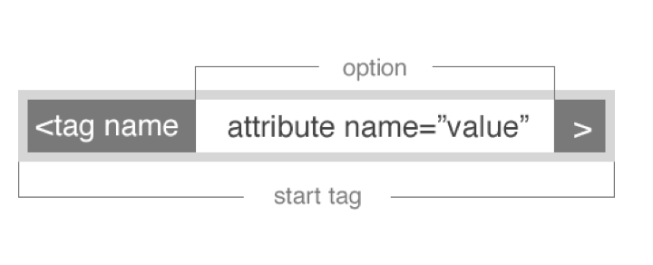

#Introduction to Ruby

##HTML Syntax Refresher
- Tags are elements on the page. Each have their own name and are enclosed by the caret syntax.


- Most tags have attributes that can add additional information to the element.



##Content Tags

#####Heading Elements

```
<h1>Largest Heading</h1>
<h2>...</h2>
<h3>...</h3>
<h4>...</h4>
<h5>...</h5>
<h6>Smallest Heading</h6>
```

#####Text Elements

```
<p>This is a Paragraph</p>

<strong>This is some Bold Text</strong>

<small>This is some Small Text</small>
```

#####Lists

```
<ul>
	<li>First List Item</li>
	<li>Second List Item</li>
	<li>Third List Item</li>
	<li>Fourth List Item</li>
</ul>
```

```
<ol>
	<li>First List Item</li>
	<li>Second List Item</li>
	<li>Third List Item</li>
	<li>Fourth List Item</li>
</ol>
```

#####Links

```
<a href="mylink.html">My Link</a>
```

##Using CSS with HTML
- There are three main ways to use CSS - inline styles, the `style` tag in the `head`, and a separate .css file that is linked to the HTML.
- Linking a stylesheet to the HTML document is the best-practice way to use CSS styles.
- Here is the syntax for the `link` tag:

```
<link rel="stylesheet" href="style.css" />
```

##CSS Breakdown
- Each CSS style set starts with a selector.
- Selectors allow you to identify which elements you want to apply styles to.
- Here is an example of a selector with a couple rules:

```
p {
	color: red;
	font-weight: bold;
	background-color: blue;
}
```

- This example selects all paragraph tags on the page and applies the below styles to them.

##CSS Selectors
- There are three common basic selectors in CSS.
- The first is the element selector. This is not a very specific selector:

```
div {
	color: red;
}

table {
	color: red;
}

p {
	color: red;
}
```

- The second is the id selector. By convention id's should not be used more than once per page:

```
#my-div {
	background-color: #990000;
}
```

- The third is the class selector. Classes by convention can be used multiple times throughout the page:

```
.my-divs {
	background-color: #EBEBEB;
}
```

##CSS Colors
- Colors in CSS can be defined in a few different ways.
- The first we have already seen - calling them out by their name symantically (red, green, blue, etc.)
- The second way is by using HEX colors. HEX codes represent shades of red, green, and blue.


- You can find color codes on a number of websites and other programs like Photoshop. [Colorpicker.com](http://www.colorpicker.com/) is a good example.
- Another way of defining CSS colors is via `rgba()`. Rgba accepts values for red, green, and blue as well as an alpha value for transparency.
- Each RGB value is from 0 to 255. Alpha values are from 0 to 1.

##CSS Review
- Where should CSS styles go?
- How does the CSS syntax work?
- Give examples of 3 different CSS selectors.

##Floats
- Floating elements allows us to create a nearly unlimited number of layouts using all types of block elements.
- Floating an element essentially removes it from the standard "flow" and places it to the left or right side of its container.
- Elements can have fixed width, which will wrap underneath each other if the container is smaller than the combined widths.
- You can also used percentage width, which will have the columns respond to the screen size.
- You can tell already that the calculations can get out of hand really fast...

##Element Alignment
- To determine how we can align an element we have to first know what kind of element it is.
- Inline elements can be aligned as text, so with the `text-align` CSS property.
- Block elements can be aligned using the space around them - margin. A margin set to auto for both left and right will center the element in a container.

##The Grid Layout
- Most modern layouts operate on a standard 12-column grid system.
- If you break down any of the websites you know and love you will notice many variations on the 12 column grid.
- Each column in the grid can contain nested grids itself.
- If you want a larger box, you need to have a greater column offset.
- Here is a good pictorial to help you break it down:


##Code-Along: Let's Create Our Own Grid
- We will create a 2, 4, and 6 column grid.
- We will try nesting a grid inside another grid.

##A Little About Ruby
- To practice using Ruby we can use the Interactive Ruby (IRB) tool.
- Everything is an object.
- Everything that is manipulated is an object, and the results of those manipulations are objects.
- To compare to JS, you have prototypes on objects, such as array functions like .map or .reduce that you can call on instances of array objects.
- In Ruby everything is an object and you'll be able to use object methods on it all.

Let's take a look at some examples:

```ruby
puts "Arun Sood".length
puts "Arun".index("A")
puts 35.even?
```

- We can tell that everything is an object, because everything has a "class":

```ruby
"Arun Sood".class #String
4.class #Fixnum
[].class #Array
Object.class #Class
```

- Something like this `message = "Hello World"` is essentially the equivalent of `message = String.new("Hello World")`.

- There is little conversion of type:

####JS

```ruby
console.log("Hello " + 4 + 2); //Hello 42
```

####Ruby

```ruby
puts "Hello " + 4 + 2 #no implicit conversion of Fixnum into String
```

##Modules Versus Objects

####Modules
- Modules are like libraries.
- Usually used for containing a bunch of "helper" functions that you can call throughout your program.
- Great example is the [Math module](http://www.ruby-doc.org/core-2.1.4/Math.html) built into Ruby:

```ruby
Math.sqrt(9) #3.0
```

####Objects
- Ruby is a proper object-oriented language.
- "Classes" wrap methods that are related to that object.
- Instead of prototypes in JS that relate to some object, we have classes that encapsulate methods.
- Classes can also inherit from other classes - this is called extension. We will get to this later.

```ruby
class Car
	def initialize(color, make, model)
		@color = color
		@make = make
		@model = model
	end
	
	def drive
		puts "We are now driving!"
	end
	
	def paint(new_color)
		@color = new_color
		puts @color
	end
	
	def describe_car
		puts "We are driving in the #{@color} #{@make} #{@model}"
	end
end

Car.new("Red", "Honda", "Civic").paint("Blue")
```

##Scope in Classes
- Scope within classes is a little tricky in Ruby because there are ways to manipulate it.
- Unlike JS that with some exceptions variables and functions stay within their scope, Ruby variables and methods can transcend it.
- Let's look at a few examples:

#####Global variables
- Global variables are available throughout your entire application.
- These variables alter the global status and are not recommended.

```ruby
$global_variable = 10

class Class1
	def print_global
		puts "Global variable in Class1 is #$global_variable"
	end
end

class Class2
	def print_global
		puts "Global variable in Class2 is #$global_variable"
	end
end

class1obj = Class1.new
class1obj.print_global
class2obj = Class2.new
class2obj.print_global
```

#####Instance variables
- Instance variables begin with @.
- Upon instantiation of the class these variables become defined through the initializer and can be used throughout the class.

```ruby
class Customer
	def initialize(id, name, addr)
		@cust_id=id
		@cust_name=name
		@cust_addr=addr
	end
   
   def display_details()
   		puts "Customer id #@cust_id"
   		puts "Customer name #@cust_name"
   		puts "Customer address #@cust_addr"
   	end
end

# Create Objects

cust1=Customer.new("1", "John", "Wisdom Apartments, Ludhiya")
cust2=Customer.new("2", "Poul", "New Empire road, Khandala")

# Call Methods

cust1.display_details()
cust2.display_details()
```

#####Class variables
- Class variables begin with @@.
- These variables don't need to be inside of any method to be used within a class.
- Class variables are shared among descendants of the class or module in which the class variables are defined.

```ruby
class Customer
	@@no_of_customers=0
	
	def initialize(id, name, addr)
		@cust_id=id
		@cust_name=name
		@cust_addr=addr
	end
	
	def display_details()
		puts "Customer id #@cust_id"
		puts "Customer name #@cust_name"
		puts "Customer address #@cust_addr"
	end
	
	def total_no_of_customers()
		@@no_of_customers += 1
		puts "Total number of customers: #@@no_of_customers"
	end
end

# Create Objects

cust1=Customer.new("1", "John", "Wisdom Apartments, Ludhiya")
cust2=Customer.new("2", "Poul", "New Empire road, Khandala")

# Call Methods

cust1.total_no_of_customers()
cust2.total_no_of_customers()
```

##Getting User Data in IRB
- Ruby has a method called `gets` that allows you to retrieve data from the user typing into the console.
- This method is similar to `prompt` in JS.
- In order to prevent the input from receiving a new line each time you must call the `.chomp` method:

```
message = gets.chomp
```
##In-Class Lab #1
- We will create a simple string conversion tool that take in a string and alters it using our string class methods.
- First, write one `gets` statement that will take a string from our user.
- Create a class called `ConvertString` that will wrap our methods.
- Create an initializer that will set the given string to a class variable.
- Create 4 different methods that will apply 4 string class methods to the inputted string. You can reference them [here](http://www.ruby-doc.org/core-2.1.4/String.html).
- Output the resulting string to the console using `puts`.
- Instantiate the class using each of these methods.

##In-Class Lab #2
- Let's create a simple calculator using the Ruby Math module.
- First, write two `gets` statements that will take 2 numbers from our user.
- Create a class called `Calculator` that will wrap all of our methods.
- Create an `initializer` method that takes in the 2 numbers and sets them as class variables.
- Write at least 4 methods that perform different math operations and output the result using `puts`. You can reference them [here](http://www.ruby-doc.org/core-2.1.4/Math.html).
- Instantiate your class using each of these 4 methods.
- Bonus: As a bonus you can create a simple `if else` statement that will choose which method to pick based on a third `gets` input. We will talk about this in the afternoon so you will have to look this up.
- Bonus 2: Create another method that uses one of the Math constants in your operation.

##Modules
- Let's take a deeper look into modules.
- Modules are pieces of code that are to be used like utilities throughout your application.
- Once they are defined they usually have constants and methods inside of them:

```ruby
module Week
	FIRST_DAY = "Sunday"
	
	def Week.weeks_in_month
		puts "You have four weeks in a month"
	end
	
	def Week.weeks_in_year
		puts "You have 52 weeks in a year"
	end
end
```
- FIRST_DAY is a constant, which is basically a value we can use in our application.
- Each of the methods are accessible only inside of the module.

##Require in Ruby
- In order to use modules in your application code you will have to require them in your file.

```ruby
require "week"

puts Week::FIRST_DAY

Week.weeks_in_month
```

##Module Scope
- When it comes to modules, variables and methods have the scope of the containing module.
- When defining methods you can refer to the current module via the keyword `self`.

```ruby
module Week
	FIRST_DAY = "Sunday"
	
	def self.weeks_in_month
		puts "You have four weeks in a month"
	end
	
	def self.weeks_in_year
		puts "You have 52 weeks in a year"
	end
end
```

##Module Exercise
- We will practice our modules by refactoring our current code for the string converter and the calculator exercises.
- Try to move the main logic of the application into modules for each of these exercises and require them in a master Ruby file.
- Call each of the methods defined in your new modules.

##Hashes
- Hashes are just a key-value data structure.
- Let's make one:

```ruby
book_ratings = {
	"Stranger in a Strange Land" => 3,
	"2001: A Space Odyssey" => 5,
	"The Hitchhiker's Guide to the Galaxy" => 4,
	"War and Peace" => 5,
	"I, Robot" => 4
}
```

What if we wanted to get fancy?

```ruby
books_by_author = {
	"Asimov, Isaac" => {
		"I, Robot" => 4,
		"Foundation" => 5,
		"Foundation and Empire" => 5
	},
	"Tolstoy, Leo" => {
		"War and Peace" => 4,
		"Anna Karenina" => 5,
		"The Death of Ivan Ilyich" => 4
	},
	"Adams, Douglas" => {
		"The Hitchhiker's Guide to the Galaxy" => 4
	},
	"Heinlein, Robert" => {
		"Stranger in a Strange Land" => 3
	},
	"Clarke, Arthur, C." => {
		"2001: A Space Odyssey" => 5
	}
}
```

- What is one possible issue that you can think of with the above?
- Generally, you don't want to have very hard to manipulate long hash keys.
- So, let's go to something more straightforward.
- An actual use for hashes might be to count things, in, let's say a category. Let's consider a bookshelf, again, but this time, just count the number of books that are on the shelf, per genre:

```ruby
books_by_genre = {
	"pulp" => 3,
	"scifi" => 10,
	"nonfic" => 10,
	"comedy" => 4,
	"tragedy" => 5,
	"romance" => 0
}
```

##A Few Hash Use Cases

#####Let's find out all the genres:

```ruby
books_by_genre.keys
```

#####Let's find out the numbers of books, without the categories:

```ruby
books_by_genre.values
```

#####Let's see if the hash contains a certain genre:

```ruby
books_by_genre.include? "pulp"
```

#####How about deleting a genre entirely? I hate pulp. Easy:

```ruby
books_by_genre.keep_if do |k,v| 
	["scifi", "nonfic", "comedy", "tragedy", "romance"].include? k
end
```

#####or, a cleaner method:
```ruby
books_by_genre.reject { |k,v| k == "pulp" }
```

##Ruby "Mutator" and "Test" Methods
- Let's take a look at `books_by_genre` again.
- Was it modified?
- What if you use the `reject!` version?
- Do you see the pattern of having `?` and `!` at the end of method names?

##Accessing a Hash and Reassigning Values
- Let's take a look at this case:

```ruby
books_by_genre["pulp"] = 1000
```

- Reassigning to a hash key that already exists, doesn't create a new hash key with that value. Hash keys are unique. Collisions are overriden.
- What if we tried to use dot notation like in JavaScript?

```ruby
books_by_genre.pulp
> NoMethodError: undefined method `pulp' for #<Hash:0x00000105b03f28>
```

- To Access hash values you can either use the bracket with a string syntax like this:

```ruby
books_by_genre["pulp"]
```

Or you can use the symbol syntax:

```ruby
books_by_genre[:pulp]
```

##.merge Method
- Merge allows you to add keys with values to hashes.
- Merge is especially used to add parameters to hashes that come from form data in web applications.

```ruby
book_by_genre.merge(action: 2)
```
##Arrays

There are several ways to create an array:

```ruby
arr = [1,2,3]
=> [1,2,3]
arr1 = Array.new([4,5,6])
=> [4,5,6]
arr2 = Array.new(3, true)
=> [true, true, true]
```
##Ranges

Ranges are sets of values with a beginning and an end:

```ruby
aRange = (1..10) # includes 10
anotherRange = (1...10) # not including 10
lettersWorkToo = ('a'..'z')
```

Ranges are often seen in conjunction with the FOR loop:

```ruby
for i in 1..20
	puts i
end
```

You can also do this for arrays like we did with JavaScript:

```ruby
for i in 0...array.length
	puts array[i]
end
```

##Iterators (Enumerators)

####.each
- This is likely to be the most common iterator you see.
- It is similar to the forEach loop in JS.

```ruby
[1, 2, 3, 4].each do |item|
	puts item
end
```

- We will see each index in the console as the iterator works its way through the data.
- Arrays are the most common objects that we usually iterate over, but in Ruby there are multiple ways of defining sets of data.

```ruby
%w(1 2 3 4) #["1", "2", "3", "4"]
```

####.each_with_index
- This is a variant on `.each`, and it allows you to pass the current index into the block:

```ruby
[1, 2, 3, 4].each_with_index do |number, index|
	puts index
end
```

####.reduce
- Reduce takes a collection of data and "reduces" it to a single value.
- An example of why you would use this may be to sum the values of an array.

```ruby
[1, 2, 3].reduce { |sum, el|
	sum + el
}
```

####.map
- Map will run an operation for every index of an array.

```ruby
[1, 2, 3, 4].map { |element|
	element + 1
}
```

- Often times you will also want the index to use inside of the block.
- This can be accomplished with the `map.with_index` method.

```ruby
[1, 2, 3, 4].map.with_index { |element, index|
	element + index
}
```

- `.map` can also be a "mutator" method by calling it with a bang - `.map!`. Using this notation will permanently change the original array.

```ruby
[1, 2, 3, 4].map!.with_index { |element, index|
	element + index
}
```